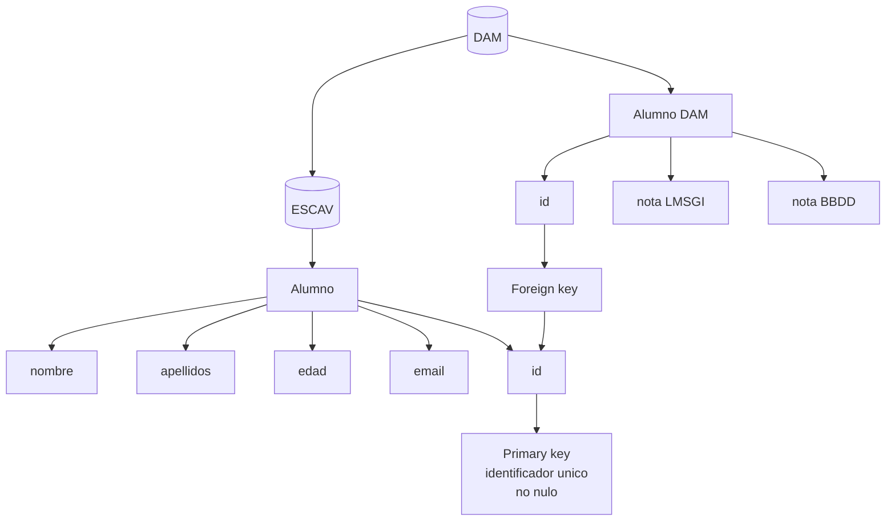
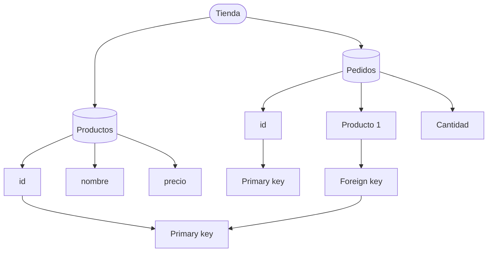

# SQLite
SQLite es un sistema de gestión de bases de datos relacional contenida y ligera, escrita en C. Es un proyecto de dominio público, de código abierto. SQLite no es un motor de base de datos cliente-servidor tradicional como por ejemplo MySQL, PostgreSQL, etc. SQLite es una biblioteca que se enlaza con el programa que la usa. El programa y la biblioteca SQLite acceden a archivos ordinarios almacenados en disco. Esto lo hace mas simple y facil de usar en comparacion a otros sistemas, también hace que sea mas rapido.

No es la solución perfecta, pero utiliza la misma sintaxis que otros motores de bases de datos, por lo que migrar nuestra aplicación a otro motor de bases de datos no es un problema.

## Tablas
Las tablas son la estructura básica de una base de datos relacional. Una tabla es un conjunto de datos estructurados en filas y columnas. Cada fila de la tabla es un registro, y cada columna de la tabla es un campo. Los campos de una tabla son los atributos de los registros de la tabla.

### Tipos de datos
Los tipos de datos mas comunes son:

- `INTEGER`: Número entero
- `REAL`: Número de punto flotante
- `TEXT`: Cadena de caracteres
- `BLOB`: Datos binarios

Debemos tener en cuenta que SQLite es dinamicamente tipado, por lo que no es necesario especificar el tipo de dato de una columna, pero es recomendable hacerlo.

Este comportamiento es diferente a otros motores de bases de datos como MySQL o PostgreSQL, que son estaticamente tipados, por lo que es necesario especificar el tipo de dato de una columna.

Si migramos nuestra aplicación a otro motor de bases de datos, es posible que tengamos que especificar el tipo de dato de las columnas y ajustar el tipo de dato de las columnas.

### Claves primarias (PK)
Cualquier tabla puede tener una clave primaria. Una clave primaria es un campo o conjunto de campos que identifican un registro de la tabla. Una clave primaria no puede contener valores nulos y no puede repetirse en otros registros de la tabla.

Para crear una clave primaria, utilizaremos la sentencia `PRIMARY KEY` junto al campo que queremos que sea la clave primaria.

### Claves foráneas (FK)
Una clave foránea es un campo o conjunto de campos que identifican un registro de otra tabla. Una clave foránea puede contener valores nulos y puede repetirse en otros registros de la tabla.





### No nulidad (NN)

Los valores nulos son valores que no existen. Los valores nulos se utilizan para indicar que un valor no existe o que no se conoce.

En SQL, podemos hacer que un campo no acepte valores nulos utilizando la sentencia `NOT NULL`.

### Unicidad (UN)

Los valores únicos son valores que no se repiten. Los valores únicos se utilizan para indicar que un valor no se puede repetir.

En SQL, podemos hacer que un campo no se repita utilizando la sentencia `UNIQUE`.

### Autoincremento (AI)

Los valores autoincrementales son valores que se incrementan automáticamente. Los valores autoincrementales se utilizan para indicar que un valor se incrementa automáticamente.

En SQL, podemos hacer que un campo se incremente automáticamente utilizando la sentencia `AUTOINCREMENT`.

### Creación de tablas

Para crear una tabla, utilizaremos la sentencia `CREATE TABLE` junto al nombre de la tabla y los campos de la tabla.

```sql
CREATE TABLE alumnos (
    id INTEGER PRIMARY KEY,
    nombre TEXT NOT NULL,
    apellidos TEXT NOT NULL,
    edad INTEGER NOT NULL,
    email TEXT NOT NULL
);
```

```sql
CREATE TABLE productos (
    id INTEGER PRIMARY KEY,
    nombre TEXT NOT NULL,
    precio REAL NOT NULL
);
```

```sql
CREATE TABLE pedidos (
    id INTEGER PRIMARY KEY,
    id_producto INTEGER NOT NULL,
    cantidad INTEGER NOT NULL,
    FOREIGN KEY (id_producto) REFERENCES productos (id)
);
```

## Consultas

Las consultas son la forma de obtener información de una base de datos. Las consultas se realizan utilizando la sentencia `SELECT`.

### Obtener todos los registros

Para obtener todos los registros de una tabla, utilizaremos la sentencia `SELECT` junto al nombre de la tabla.

```sql
SELECT * FROM alumnos;
```

```sql
SELECT * FROM productos;
```

### Obtener registros con condiciones

Para obtener registros con condiciones, utilizaremos la sentencia `SELECT` junto al nombre de la tabla y la sentencia `WHERE` junto a la condición.

```sql
SELECT * FROM alumnos WHERE edad > 18;
```

```sql
SELECT * FROM productos WHERE precio > 10;
```

### Obtener registros con condiciones y ordenados

Para obtener registros con condiciones y ordenados, utilizaremos la sentencia `SELECT` junto al nombre de la tabla, la sentencia `WHERE` junto a la condición y la sentencia `ORDER BY` junto al campo por el que queremos ordenar.

```sql
SELECT * FROM alumnos WHERE edad > 18 ORDER BY edad;
```

```sql
SELECT * FROM productos WHERE precio > 10 ORDER BY precio;
```

### Obtener registros con condiciones, ordenados y limitados

Para obtener registros con condiciones, ordenados y limitados, utilizaremos la sentencia `SELECT` junto al nombre de la tabla, la sentencia `WHERE` junto a la condición, la sentencia `ORDER BY` junto al campo por el que queremos ordenar y la sentencia `LIMIT` junto al número de registros que queremos obtener.

```sql
SELECT * FROM alumnos WHERE edad > 18 ORDER BY edad LIMIT 10;
```

### Ingresar registros

Para ingresar registros, utilizaremos la sentencia `INSERT INTO` junto al nombre de la tabla y los valores de los campos.

```sql
INSERT INTO alumnos (nombre, apellidos, edad, email) VALUES ("Maria", "Delgado", 30, "
```

```sql
INSERT INTO productos (nombre, precio) VALUES ("Ordenador", 1000);
```

### Actualizar registros

Para actualizar registros, utilizaremos la sentencia `UPDATE` junto al nombre de la tabla, la sentencia `SET` junto a los campos que queremos actualizar y la sentencia `WHERE` junto a la condición.

```sql
UPDATE alumnos SET edad = 31 WHERE id = 1;
```

```sql
UPDATE productos SET precio = 1100 WHERE id = 1;
```

### Eliminar registros

Para eliminar registros, utilizaremos la sentencia `DELETE FROM` junto al nombre de la tabla y la sentencia `WHERE` junto a la condición.

```sql
DELETE FROM alumnos WHERE id = 1;
```

```sql
DELETE FROM productos WHERE id = 1;
```

