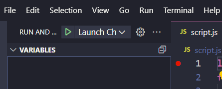
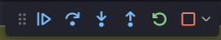

# Debugging

JavaScript es un lenguaje interpretado, lo que significa que el navegador ejecuta el código de arriba hacia abajo, línea por línea. Esto es diferente de los lenguajes compilados, como Java o C++, que se ejecutan en un proceso de compilación antes de que el programa se ejecute.

El proceso de compilación convierte el código fuente en un programa ejecutable. Si hay un error en el código, el proceso de compilación fallará y no se creará el programa ejecutable. Esto significa que no se puede ejecutar el programa hasta que se corrija el error.

En JavaScript, el código se ejecuta en el navegador y se puede ejecutar incluso si hay errores en el código. Esto significa que puede ser difícil seguir y encontrar errores en el código.

Con el tiempo, y cuanto más conozcas los aspectos base de JavaScript, podrás encontrar y corregir errores más fácilmente. Pero incluso los programadores más experimentados cometen errores, y es importante saber cómo encontrarlos y corregirlos.

## Errores de sintaxis

Los errores de sintaxis son errores de escritura en el código. El navegador no puede interpretar el código y no puede ejecutarlo. Los errores de sintaxis son fáciles de encontrar porque el navegador mostrará un mensaje de error en la consola.

En muchas ocasiones el mensaje de error nos indicará la línea y el archivo donde se encuentra el error.

Analiza **cada** parte del mensaje de error, ya que te dice exactamente dónde está el error y qué lo causó.

Si el error te deja ver la linea en la que se encuentra, revisa esa linea y las anteriores, ya que el error puede estar en una linea anterior, asegúrate de revisar **cada** elemento de la linea.

Prueba a simplemente, reescribir la linea, a veces el error es simplemente un error de escritura, piensa de manera intencionada cada expresion que escribas mientras lo haces.

## Errores lógicos

Los errores lógicos son errores en el código que hacen que el programa se ejecute, pero no de la manera que se esperaba. Por ejemplo, si se espera que el programa muestre un mensaje de error cuando el usuario ingresa una contraseña incorrecta, pero no lo hace, hay un error lógico en el código.

Los errores lógicos son más difíciles de encontrar que los errores de sintaxis porque el navegador no muestra ningún mensaje de error. El programa se ejecuta, pero no funciona como se esperaba.

Para encontrar errores lógicos, es importante comprender el código y lo que se supone que debe hacer. Si el código no funciona como se esperaba, es posible que deba agregar más mensajes de consola para ver qué está sucediendo.

Traza la información linea a linea, comenta lineas de código para ver si el error se encuentra en esa linea, si no es así, descomenta la linea y comenta la siguiente, y así sucesivamente.

Imprimir los datos por consola es una buena manera de ver que está pasando linea a linea.

## Debugging

Imprimir datos en consola puede ser un proceso lento y tedioso, por lo que es importante aprender a usar las herramientas de depuración del navegador o de tu editor de código.

La depuración es el proceso de encontrar y corregir errores en el código. La depuración es una habilidad importante para los programadores, y es importante practicarla.

La depuración es un proceso iterativo. Esto significa que es posible que no encuentres el error la primera vez que lo busques. Es posible que deba buscar el error varias veces antes de encontrarlo y corregirlo.

## Depuración con VScode

VScode tiene una herramienta de depuración integrada que te permite ejecutar el código paso a paso y ver los valores de las variables en cada paso.

0. Asegúrate de tener un live-server funcionando en tu proyecto.
1. Entra al menú Run & Debug en la parte izquierda del editor, o pulsa `Ctrl + Shift + D` en Windows o `Cmd + Shift + D` en Mac.


2. Haz click en `Run and debug` y selecciona `Web app (Chrome)`
3. Configura tu json, asegúrate que la propiedad `url` tenga el mismo valor que la url de tu live-server:
```json
    "url": "http://localhost:8080",
```
4. Añade un breakpoint en la linea donde quieras empezar a depurar, puedes hacerlo haciendo click en el numero de linea en tu editor.
5. Haz click en el play `Launch Chrome against localhost` en la parte superior del editor.

6. Utiliza los controles de la parte superior del editor para avanzar paso a paso, o para continuar hasta el siguiente breakpoint.
