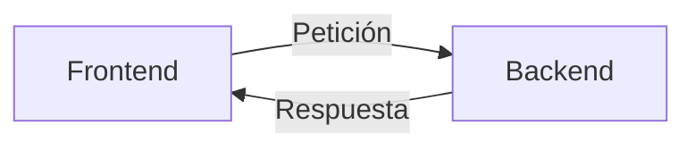

# Backend

Un backend es la parte de un sistema informático que no es visible para el usuario. Es la parte que se encarga de gestionar la información y de realizar las operaciones necesarias para que el sistema funcione correctamente.

En web, el backend es el encargado de recibir las peticiones del cliente, procesarlas y enviar una respuesta. Por ejemplo, cuando un usuario hace click en un botón, el frontend envía una petición al backend, el backend procesa la petición y envía una respuesta al frontend.

Estas peticiones pueden ser de diferentes tipos, como `GET`, `POST`, `PUT`, `PATCH`, y `DELETE`. Cada uno de estos tipos de peticiones tiene un significado específico, y el backend debe saber cómo manejarlos.

Además, las respuestas y las peticiones pueden contener datos, desde los headers, hasta el cuerpo de la petición. El backend debe saber cómo manejar estos datos para poder procesar las peticiones y enviar las respuestas.

## Tecnologías de backend

Existen muchas tecnologías que podemos usar para desarrollar el backend de una aplicación web. Algunas de las más populares son:

- **Node.js**: Node.js es un entorno de ejecución para JavaScript que nos permite ejecutar código JavaScript en el servidor. Node.js es muy popular para desarrollar el backend de aplicaciones web, ya que nos permite usar el mismo lenguaje en el frontend y en el backend.

- **Express**: Express es un framework de Node.js que nos permite crear aplicaciones web de forma sencilla. Express nos proporciona una serie de herramientas que nos facilitan el desarrollo de aplicaciones web, como el manejo de rutas, el manejo de peticiones y respuestas, y el manejo de middlewares.

- **FastAPI**: Framework en Python.

- **Django**: Framework en Python.

- **Flask**: Microframework en Python.

- **Ruby on Rails**: Framework en Ruby.

- **Laravel**: Framework en PHP.

- **Spring Boot**: Framework en Java.

- **ASP.NET**: Framework en C#.

## ¿Por qué Node.js?

Node.js es muy popular para desarrollar el backend de aplicaciones web por varias razones:

- **JavaScript en el frontend y en el backend**: Node.js nos permite usar el mismo lenguaje en el frontend y en el backend, lo que nos permite reutilizar código y conocimientos.

- **Event-driven y asíncrono**: Node.js está diseñado para ser event-driven y asíncrono, lo que significa que es muy eficiente para manejar un gran número de peticiones simultáneas.

- **Gran ecosistema de módulos**: Mediante npm podemos instalar módulos de terceros que nos permiten extender las funcionalidades de Node.js.

- **Gran comunidad**: Node.js tiene una gran comunidad de desarrolladores detrás, es fácil encontrar soluciones y ayuda en caso de problemas.

## Algunos conceptos que debemos conocer sobre backend

### Peticiones y respuestas

Las peticiones y respuestas son la forma en la que el frontend y el backend se comunican. Las peticiones son las solicitudes que el frontend envía al backend, y las respuestas son las respuestas que el backend envía al frontend.

### Métodos http

Los métodos http son los verbos que se utilizan para indicar la acción que se quiere realizar sobre un recurso. Algunos de los métodos http más comunes son:

- `GET`: Se utiliza para obtener información de un recurso.
- `POST`: Se utiliza para crear un nuevo recurso.
- `PUT`: Se utiliza para actualizar un recurso.
- `PATCH`: Se utiliza para actualizar parcialmente un recurso.

### Cabeceras

Las cabeceras son metadatos que se envían junto con las peticiones y las respuestas. Las cabeceras pueden contener información sobre la petición o la respuesta, como el tipo de contenido, la longitud del contenido, la fecha de la petición, etc.

Podemos acceder a las cabeceras de la petición en Express a través de la propiedad `req.headers`.

### Middleware

Los middlewares son funciones que se ejecutan antes de que se ejecute la ruta. Los middlewares nos permiten realizar operaciones comunes a varias rutas, como la validación de datos, la autenticación de usuarios, el manejo de errores, etc.

Existen varios tipos de middleware. Los más comunes son los siguientes:

- **Middleware de ruta**: Se ejecuta antes de que se ejecute una ruta concreta.
- **Middleware de error**: Se ejecuta cuando ocurre un error.
- **Middleware de aplicación**: Se ejecuta antes de que se ejecute cualquier ruta.
- **Middleware de terceros**: Son middlewares que han sido desarrollados por otra persona, y que podemos instalar en nuestro proyecto.

### Rutas

Las rutas son las direcciones que se utilizan para acceder a los recursos en una aplicación web. En Express, podemos crear rutas usando el método `get`, `post`, `put`, `patch`, y `delete`.

### Vistas

Las vistas son las plantillas que se utilizan para generar el contenido que se envía al cliente. En Express, podemos utilizar un motor de plantillas como `pug` o `ejs` para generar vistas dinámicas.

### Controladores

Los controladores son funciones que se encargan de manejar las peticiones que llegan al servidor. En Express, podemos utilizar controladores para manejar las peticiones que llegan a una ruta concreta.

### Modelos

Los modelos son las representaciones de los datos que se utilizan en una aplicación web. En Express, podemos utilizar un ORM como `sequelize` o `mongoose` para interactuar con la base de datos.

### Base de datos

La base de datos es el lugar donde se almacenan los datos de una aplicación web. En Express, podemos utilizar una base de datos relacional como `MySQL` o `PostgreSQL`, o una base de datos no relacional como `MongoDB`, aunque puedes usar archivos JSON o SQLite.

### Autenticación y autorización

La autenticación y la autorización son los procesos que se utilizan para identificar a los usuarios y para controlar el acceso a los recursos de una aplicación web. En Express, podemos utilizar middlewares para manejar la autenticación y la autorización de los usuarios como `passport` o `express-jwt`.

### Testing

El testing es el proceso que se utiliza para comprobar que una aplicación web funciona correctamente. En Express, podemos utilizar herramientas como `mocha` o `jest` para realizar tests unitarios y de integración.

### Despliegue

El despliegue es el proceso que se utiliza para poner una aplicación web en producción. En Express, podemos utilizar servicios como `Heroku`, `AWS`, `Azure`, `Google Cloud`, `Digital Ocean`, `Vercel`, `Netlify`, `Zeit`, `Now`, `Glitch`, `Firebase`, `Surge`, `GitHub Pages`, `GitLab Pages`, `Bitbucket`, `GitLab`, `Travis CI`, `Circle CI`, `Jenkins`, `Netlify`, `Vercel`, `Zeit`, `Now`, `Glitch`, `Firebase`, `Surge`, `GitHub Pages`, `GitLab Pages`, `Bitbucket`, `GitLab`, `Travis CI`, `Circle CI`, `Jenkins`, `Netlify`, `Vercel`, `Zeit`, `Now`, `Glitch`, `Firebase`, `Surge`, `GitHub Pages`, `GitLab Pages`, `Bitbucket`, `GitLab`, `Travis CI`, `Circle CI`, `Jenkins`, `Netlify`, `Vercel`, `Zeit`, `Now`, `Glitch`, `Firebase`, `Surge`, `GitHub Pages`, `GitLab Pages`, `Bitbucket`, `GitLab`, `Travis CI`, `Circle CI`, `Jenkins`, `Netlify`, `Vercel`, `Zeit`, `Now`, `Glitch`, `Firebase`, `Surge`, `GitHub Pages`, `GitLab Pages`, `Bitbucket`, `GitLab`, `Travis CI`, `Circle CI`, `Jenkins`, `Netlify`, `Vercel`, `Zeit`, `Now`, `Glitch`, `Firebase`, `Surge`, `GitHub Pages`, `GitLab Pages`, `Bitbucket`, `GitLab`, `Travis CI`, `Circle CI`, `Jenkins`, `Netlify`, `Vercel`, `Zeit`, `Now`, `Glitch`, `Firebase`, `Surge`, `GitHub Pages`, `GitLab Pages`, `Bitbucket`, `GitLab`, `Travis CI`, `Circle CI`, `Jenkins`, `Netlify`, `Vercel`, `Zeit`, `Now`, `Glitch`, `Firebase`, `Surge`, `GitHub Pages`, `GitLab Pages`, `Bitbucket`, `GitLab`, `Travis CI`, `Circle CI`...
