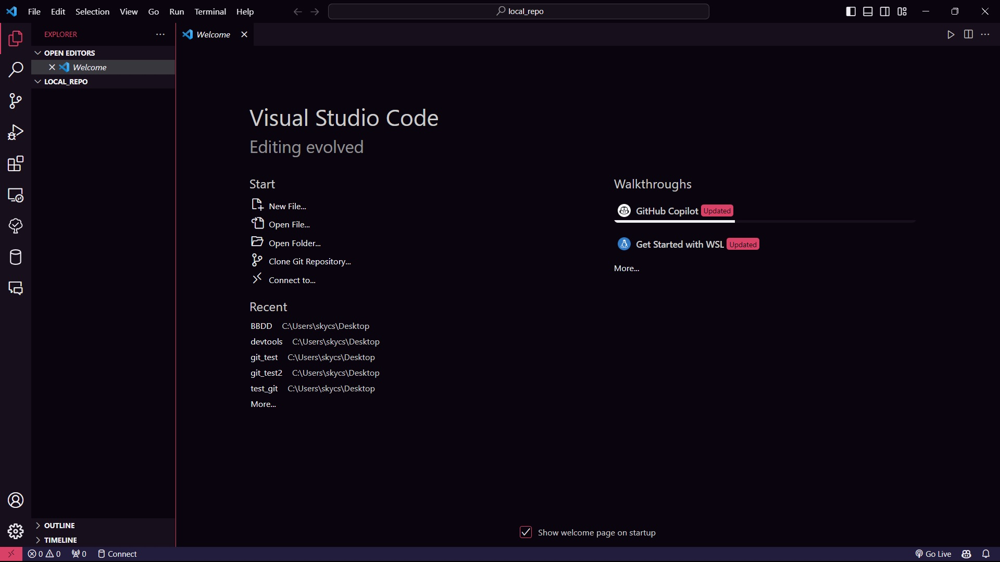
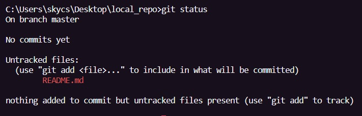
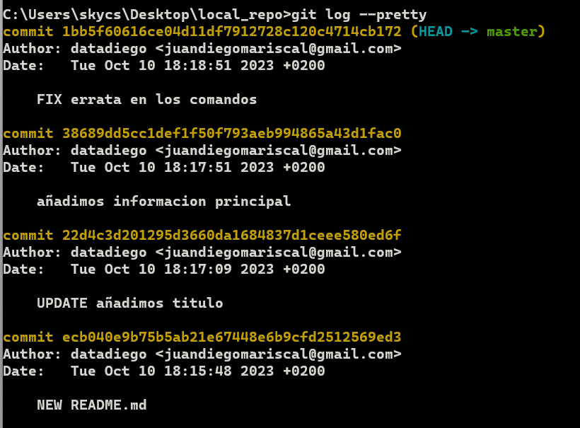

# Practica 1
## Repositorios locales
En esta práctica vamos a empezar a configurar nuestros equipos, a crear un repositorio local y a trabajar con él.

Cuando acabes la práctica, deberías tener una idea más clara de cómo funciona Git, y de cómo podemos empezar a integrarlo en nuestro flujo de trabajo 💪

Os recomiendo que leáis la documentación que os he dejado sobre Git y Github en el repositorio [devtools](https://github.com/escavdam/devtools) antes de empezar, os dará una idea más clara de lo que vamos a hacer y como funciona Git.

¡Al lio!

### Creando la carpeta del proyecto

Crea una carpeta vacía donde prefieras, con el nombre "local_repo", y abre la carpeta con Visual Studio Code.



> **Recuerda** que puedes hacer click derecho en la carpeta y seleccionar la opción `Abrir con Code`, también puedes usar el comando `cd` para navegar hasta la carpeta y ejecutar `code .` para abrirla.

>Asegurate de tener todo bien actualizado en VScode buscando la opción en el icono de ajustes ⚙️ en la esquina inferior izquierda.

### Crear un repositorio local
Vamos a activar git en esta carpeta para poder empezar a trabajar con él.

Abre la terminal integrada con `Ctrl + ñ` y ejecuta el siguiente comando:

```bash
git init
```
Este comando inicializa un repositorio git en la carpeta actual, y crea una carpeta oculta llamada `.git` donde se guardará toda la información de git.

### Mandando cambios a nuestro repositorio

Crea un archivo llamado README.md en la carpeta, y añadele el siguiente contenido:

```markdown
# Mi primer repo local
```

Guarda los cambios en README.md y vuelve a la terminal.

Ejecuta el siguiente comando para ver el estado de nuestro repositorio:

```bash
git status
```

Deberías ver algo como esto:



Git nos está diciendo que tenemos un archivo nuevo, y que no está siendo seguido por git en el repositorio.

Para que git empiece a seguir los cambios de este archivo, debemos añadirlo al **staging area** utilizando `git add`.

Ejecuta el siguiente comando:

```bash
git add README.md
```

Si volvemos a ejecutar `git status`, veremos que el archivo ha sido añadido al staging area, y está esperando que, o bien añadamos más archivos relativos a este cambio con `git add`, o bien lo confirmemos.

Ejecuta el siguiente comando para confirmar los cambios:

```bash
git commit -m "Añadido README.md"
```

> **Recuerda**, este comando lleva una opcion adicional `-m` que nos permite añadir un mensaje al commit, es una buena práctica añadir un mensaje descriptivo para que sea más fácil entender los cambios que hemos hecho, un commit vacío es un peligro para nuestro yo del futuro, que no sabrá que cambios hemos hecho.

Ejecuta un git status para comprobar que no tenemos cambios pendientes. 

### Añadiendo mas cambios al repositorio

Vuelve a editar tu README.md con el siguiente contenido:

```markdown
# Mi primer repo local

En este repo estoy aprendiendo a usar los comandos básicos de git:
- git start
- git add
- git commit 
```

Intenta mandar los cambios a tu repositorio local utilizando los comandos que hemos visto previamente.

### Corrigiendo errores

¡La hemos liado en nuestro README.md! 💀 Hemos escrito `git start` en los comandos que hemos añadido, no nos hemos dado cuenta hasta que hemos confirmado los cambios y ese no es el comando correcto.

Intenta arreglarlo, y manda los cambios a nuestro repositorio local como hemos visto hasta ahora.

Cuando hayas terminado, ejecuta el siguiente comando:

```bash
git log --pretty
```

Esto te mostrará un historial de los commits que has hecho hasta ahora, el mensaje que has añadido, y un hash único que identifica cada commit.

Veremos más adelante como podemos usar este hash para volver a un commit anterior :)


**⚠️Guarda un pantallazo de este historial, lo necesitaremos más adelante en la siguiente practica.⚠️**

> La combinacion `windows + s` nos deja hacer pantallazos de una parte de la pantalla, y guardarlos en el portapapeles.

> **Recuerda** que puedes usar `git log --pretty=oneline` para ver un historial más compacto, o `git log --pretty=format:"%h - %an, %ar : %s"` para ver un historial más detallado.

¡Felicidades! Has creado tu primer repositorio local, has añadido cambios, corregido errores y has consultado tu historial de cambios.

> ¿Sientes que esto es un "guardar archivo" con pasos extra? ¡No te preocupes! Ahora mismo hemos escrito un texto muy simple, pero cuando estemos trabajando en proyectos más grandes, con más archivos y más cambios, veremos como git nos ayuda a mantener todo organizado y a no perder cambios importantes.