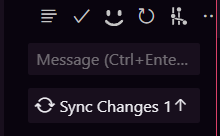

# Prática 2
## Repositorios remotos

Trabajar con un repositorio en local nos da bastantes ventajas, empezamos a tener un entorno seguro donde desarrollar nuestro código, y guardar puntos importantes en el progreso.

Pero, ¿qué pasa si queremos compartir nuestro código con otras personas? ¿O si queremos tener una copia de seguridad en la nube? ¿O si queremos trabajar en el mismo proyecto desde varios ordenadores? Para eso necesitamos un repositorio remoto, y para eso está [GitHub](https://github.com/)

### Clonando nuestros repositorios

Lo primero, vamos a intentar establecer conexion con los repositorios del grupo de github.

Vamos a descargar los repositorios mediante git, para ello, vamos a utilizar el comando `git clone`, seguido de la url del repositorio que queremos clonar.

Abre tu terminal, dirigete a tu escritorio (o donde prefieras tener los apuntes) y ejecuta el siguiente comando:

```bash
git clone https://github.com/escavdam/BBDD.git
git clone https://github.com/escavdam/LMGSI
git clone https://github.com/escavdam/devtools
```

Estos son los tres repositorios principales que vamos a utilizar durante el curso, y que vamos a ir actualizando con los apuntes y las prácticas nuevas.

Teniendo nuestra información lista, podemos arrancar!

> ¿Has tenido algun problema al clonar los repositorios? **Avisadme!** es la primera vez que tambien estoy tratando con una organizacion en GitHub, asi que puede que falte algun tipo de permiso, mientras tanto, continua.

### Creando un repositorio remoto

Ya vimos como arrancar un repositorio local de cero, ahora vamos a ver como crear un repositorio remoto en Github, como clonarlo a nuestro PC y como trabajar con el.

Lo primero, asegurate de cambiar a tu cuenta principal en caso de que estes en el grupo escavdam, para ello, haz click en el icono de tu perfil en la esquina superior derecha, y selecciona tu cuenta.


Busca la opción para [crear un nuevo repositorio](https://github.com/new), ponle un nombre, una descripción y marca la opción para añadir un README:


Una vez creado, deberia redirigirte a tu repositorio, donde podras ver la url del mismo, copiala, y usa `git clone tu_url` para clonarlo en tu PC, luego muevete a tu carpeta del repositorio y abrelo con visual code.


> ¿Tienes algun problema clonando tu repositorio? Lo primero, revisa si tu repositorio es **publico**, si no lo es, no podras clonarlo sin autenticarte. 
> ¿Sigues teniendo problemas? **Escríbeme**, los primeros pasos en GitHub pueden ser algo dificiles, ya que puede ser que haya que configurar algo más.

### Trabajando con repositorios remotos

Una vez tenemos abierto visual code, vamos a iniciar sesion en Github, pulsando en el icono "Accounts ", una vez iniciada la sesion, deberiamos ver nuestro username


> **Recuerda** tener vscode actualizado, pulsa en Configuracion ⚙️ y reinicia el editor si no ves el icono de cuentas.

¿Aun tienes el pantallazo de la anterior practica? Añadela a nuestro entorno de vscode, puedes arrastrarla dentro del area:


> **Observa**, ves como la imagen aparece en un color diferente al README.md eso significa que git ya esta funcionando! GitHub lo inicia al crear nuestro repositorio remoto.
>
> La (U) que aparece al lado corresponde con el estado del archivo en git, en este caso, significa que el archivo es nuevo y no esta siendo seguido por git (Untracked).
>
> Ademas, el icono de la izquierda nos indica que el archivo ha sido modificado, pero no ha sido añadido al **staging area**.
>

Añade la siguiente linea al README.md y muestra la imagen que acabas de añadir al proyecto:

```markdown
He añadido una imagen al proyecto!


```

>**Recuerda** que puedes previsualizar markdown en vscode para asegurarte de que tu imagen se muestra correctamente.

Haz click en el icono de los "Nodos" para entrar en la seccion de control de versiones


> **Observa** tenemos dos cambios en nuestro proyecto, la imagen tiene el estado (U)ntracked, y el README.md tiene el estado (M)odified, esto significa que el archivo ha sido modificado, no han sido enviados al **stagging area**.

Añade los archivos al **stagging area** pulsando sobre el icono `+` al lado de cada archivo, o sube todos con el boton `+` en `changes`:


> **Observa** como los archivos han cambiado de color, ahora tienen el estado (A)dded, esto significa que han sido añadidos al **stagging area** y estan listos para ser confirmados.
>
> Además, vscode nos muestra el estado original y editado de nuestro archivo antes de hacer nuestro commit.

Asegurate de que todo esté bien, pon un mensaje de commit, y pulsa "Commit":


Una vez realizas tu commit, tu repositorio **local** esta al dia, pero aun no hemos mandado a GitHub los cambios! 

Si todo va bien, podrás pulsar en `Sync Changes` para enviar los cambios a GitHub:



Ve a tu repositorio en GitHub, deberias poder ver tanto los commits que has realizado, como la imagen que añadiste en tu README.md con markdown.

Por defecto, GitHub renderiza el README.md de cada repositorio, asi que puedes usarlo para mostrar información sobre tu proyecto, instrucciones sobre como usarlo, colaboradores o cualquier cosa que se te ocurra.

Genial! Has terminado la segunda práctica. 

Te aconsejo que escribas algunos md nuevos y experimentes con markdown y git en este repositorio remoto para sentirte más comodo realizando commits tanto en la terminal como en la interfaz de vscode.

Mandame la url de tu repositorio a juandiegomariscal@gmail.com para que pueda verlo, y nos vemos en la siguiente practica!